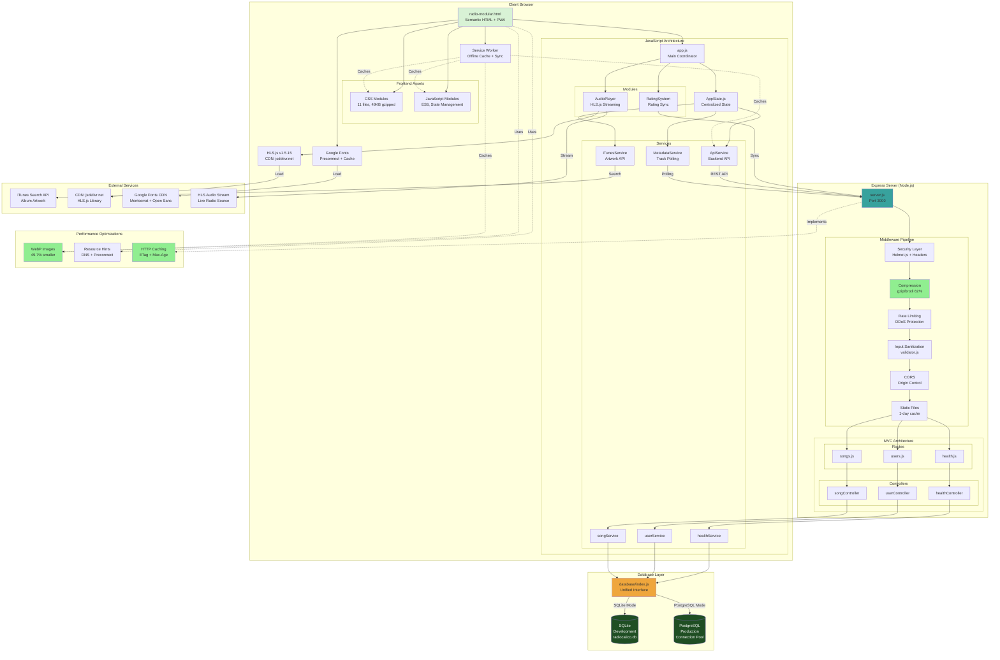
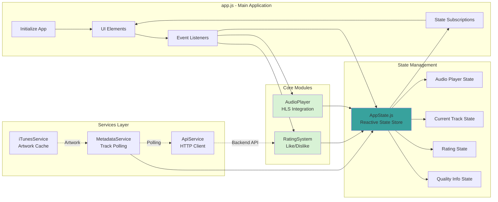
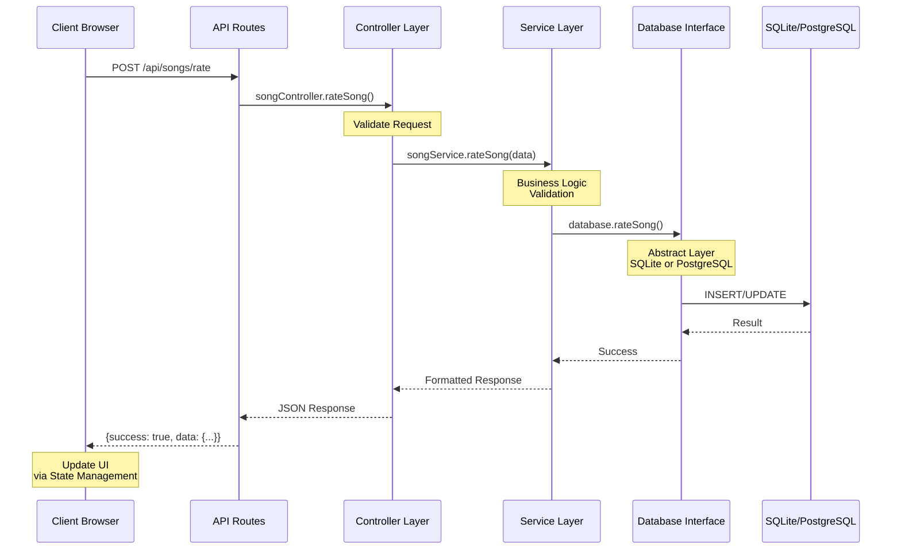
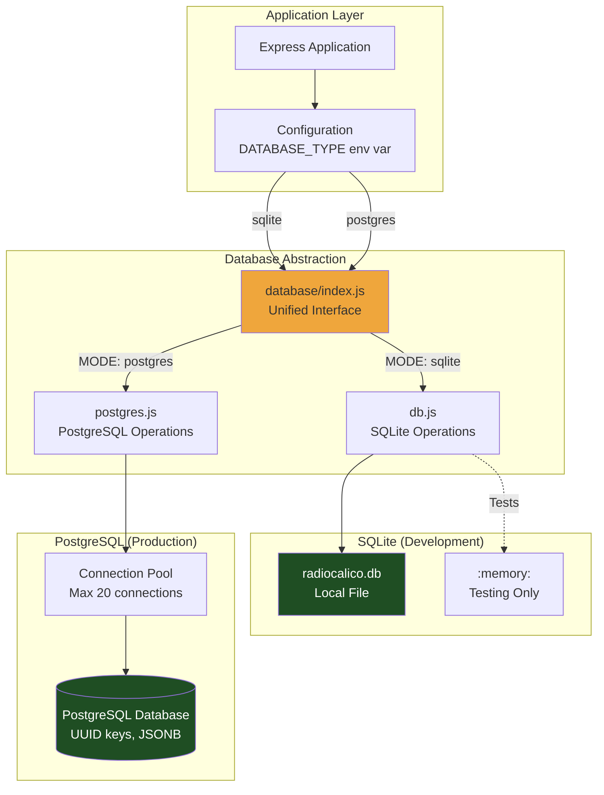
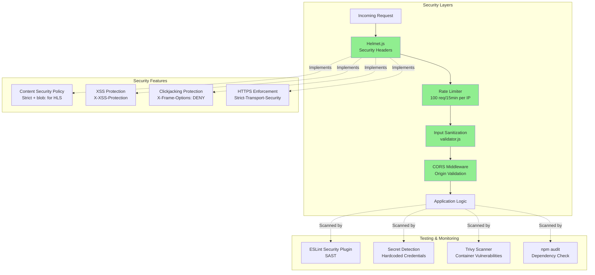
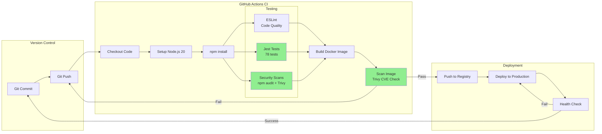

# RadioCalico System Architecture

## Complete System Architecture Diagram



## Component Details

### Frontend Layer
- **HTML**: Semantic, accessible markup with PWA capabilities
- **CSS Modules**: 11 modular files, component-based architecture
- **JavaScript**: ES6 modules with centralized state management
- **Service Worker**: Offline caching and background sync

### Middleware Stack
1. **Security Headers** (Helmet.js) - CSP, X-Frame-Options, etc.
2. **Compression** (gzip/brotli) - 62% transfer size reduction
3. **Rate Limiting** - DDoS protection
4. **Input Sanitization** (validator.js) - XSS prevention
5. **CORS** - Cross-origin resource sharing
6. **Static Files** - Optimized serving with cache headers

### Backend MVC Architecture
- **Routes**: API endpoint definitions
- **Controllers**: Request/response handling
- **Services**: Business logic layer
- **Database Interface**: Unified SQLite/PostgreSQL abstraction

### Performance Optimizations
- **WebP Images**: 49.7% size reduction
- **Resource Hints**: Preconnect and DNS prefetch
- **Compression**: gzip/brotli middleware
- **HTTP Caching**: ETag and Max-Age headers
- **Service Worker**: Aggressive static asset caching

---

## Frontend Module Architecture



## Backend MVC Flow



## Database Architecture



## Security Architecture



## Deployment Architecture

```mermaid
graph TB
    subgraph "Development Environment"
        DEV_DOCKER[Docker Container<br/>Node.js + Hot Reload]
        DEV_DB[SQLite<br/>Local File]
        DEV_VOLUMES[Volumes<br/>Code + Database]
    end

    subgraph "Production Environment"
        LB[Load Balancer<br/>nginx (planned)]

        subgraph "Application Tier"
            APP1[RadioCalico Container 1<br/>Non-root user]
            APP2[RadioCalico Container 2<br/>Non-root user]
        end

        subgraph "Database Tier"
            PG_PRIMARY[(PostgreSQL Primary<br/>Connection Pool)]
            PG_REPLICA[(PostgreSQL Replica<br/>Read-only)]
        end

        subgraph "Cache Tier"
            REDIS[(Redis Cache<br/>planned)]
        end
    end

    subgraph "CDN & External"
        CDN[CDN<br/>Static Assets]
        MONITORING[Monitoring<br/>Logs + Metrics]
    end

    DEV_DOCKER --> DEV_DB
    DEV_VOLUMES -.->|Mount| DEV_DOCKER

    LB --> APP1
    LB --> APP2

    APP1 --> PG_PRIMARY
    APP2 --> PG_PRIMARY

    APP1 -.->|Reads| PG_REPLICA
    APP2 -.->|Reads| PG_REPLICA

    PG_PRIMARY -.->|Replication| PG_REPLICA

    APP1 -.->|Cache| REDIS
    APP2 -.->|Cache| REDIS

    LB -.->|Static| CDN
    APP1 -.->|Logs| MONITORING
    APP2 -.->|Logs| MONITORING

    style APP1 fill:#38A29D
    style APP2 fill:#38A29D
    style PG_PRIMARY fill:#1F4E23,color:#fff
    style PG_REPLICA fill:#1F4E23,color:#fff
```

## CI/CD Pipeline



---

## Legend

- **Solid Lines** (→): Direct data flow or function calls
- **Dashed Lines** (-.->): Indirect relationships, caching, or monitoring
- **Green Fill**: Performance or security optimizations
- **Blue Fill**: Core application components
- **Orange Fill**: Data access layer
- **Dark Green Fill**: Database systems

---

**Last Updated:** October 2025
**Version:** 1.1.0 (Phase 1 Optimized)
