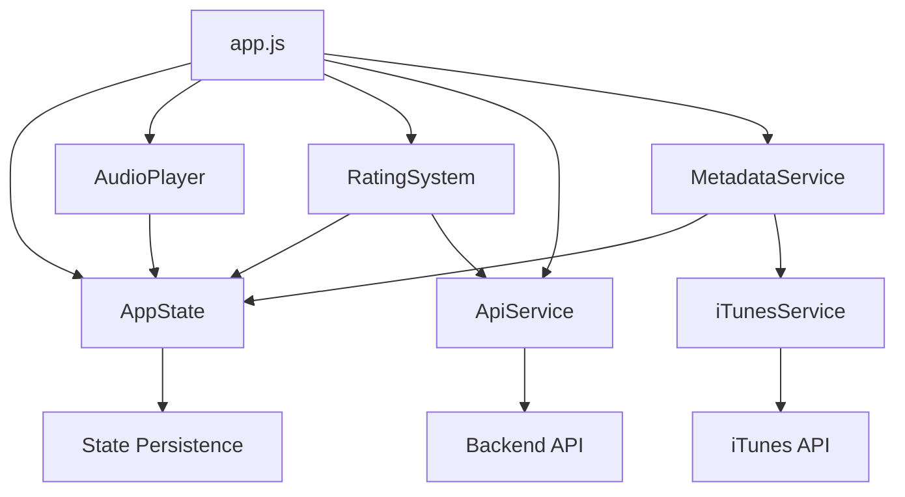

# RadioCalico JavaScript Modules Documentation

## Overview

The RadioCalico frontend JavaScript has been refactored from embedded code into a modern ES6 module system with clear separation of concerns. This document details the module architecture, state management, and component interaction patterns.

## Module Architecture

### File Structure
```
js/
├── app.js                 # Main application coordinator (350 lines)
├── utils/
│   └── AppState.js        # Centralized state management (180 lines)
├── services/
│   ├── ApiService.js      # Backend API communication (120 lines)
│   ├── iTunesService.js   # Album artwork service (200 lines)
│   └── MetadataService.js # Track metadata polling (180 lines)
└── modules/
    ├── AudioPlayer.js     # HLS.js audio streaming (200 lines)
    └── RatingSystem.js    # Song rating functionality (150 lines)
```

### Module Dependencies


## Core Modules

### Main Application (`app.js`)

The central coordinator that initializes and manages all other modules.

**Key Responsibilities**:
- Module initialization and dependency injection
- UI element binding and event delegation
- State subscription management
- Error handling and user feedback

**Class Structure**:
```javascript
class RadioCalicoApp {
  constructor() {
    this.appState = appState;
    this.apiService = apiService;
    this.uiElements = {};
    this.isInitialized = false;
  }

  async init() {
    // Dependency checks
    // UI element initialization
    // Service and module setup
    // Event listener binding
    // State subscriptions
  }

  // UI update methods
  updatePlayButton(isPlaying) { /* ... */ }
  updateTrackInfo() { /* ... */ }
  updateArtwork(artwork) { /* ... */ }
}
```

**Initialization Sequence**:
1. **Dependency Check**: Verify HLS.js and required libraries
2. **DOM Ready**: Wait for document ready state
3. **UI Elements**: Cache DOM element references
4. **Services**: Initialize external service connections
5. **Modules**: Create core functionality modules
6. **Events**: Setup user interaction handlers
7. **State**: Subscribe to state changes for UI updates

### State Management (`utils/AppState.js`)

Centralized reactive state management system inspired by Redux and MobX.

**Core Features**:
- **Reactive Updates**: Automatic UI updates on state changes
- **Subscription System**: Components subscribe to specific state slices
- **Nested State Access**: Dot notation for deep state properties
- **Batch Updates**: Multiple state changes in single update cycle

**State Structure**:
```javascript
{
  currentTrack: {
    artist: 'Shandi',
    subArtist: 'Sinnamon',
    title: 'He\'s A Dream (1983)',
    album: 'Flashdance (Original Motion Picture Soundtrack)',
    artwork: null,
    songId: null
  },
  audioPlayer: {
    isPlaying: false,
    volume: 0.7,
    elapsedTime: 35,
    status: 'Ready to play'
  },
  quality: {
    source: '16-bit 44.1kHz',
    stream: '48kHz FLAC / HLS Lossless'
  },
  rating: {
    thumbsUp: 0,
    thumbsDown: 0,
    userRating: null,
    isLoading: false
  },
  recentTracks: []
}
```

**API Methods**:
```javascript
// Subscribe to state changes
const unsubscribe = appState.subscribe('currentTrack.artist', (newArtist, oldArtist) => {
  console.log(`Artist changed from ${oldArtist} to ${newArtist}`);
});

// Update single value
appState.set('audioPlayer.isPlaying', true);

// Batch updates
appState.setBatch({
  'currentTrack.artist': 'New Artist',
  'currentTrack.title': 'New Title',
  'audioPlayer.elapsedTime': 0
});

// Get current value
const currentArtist = appState.get('currentTrack.artist');
```

**User Identification**:
```javascript
getUserIdentifier() {
  let userId = localStorage.getItem('radiocalico-user-id');
  if (!userId) {
    userId = 'user-' + Math.random().toString(36).substr(2, 9);
    localStorage.setItem('radiocalico-user-id', userId);
  }
  return userId;
}
```

## Service Layer

### API Service (`services/ApiService.js`)

Handles all communication with the RadioCalico backend API.

**Features**:
- **Unified Error Handling**: Consistent error processing and logging
- **Request/Response Interceptors**: Automatic header injection
- **Retry Logic**: Automatic retry for failed requests
- **Type Safety**: JSDoc annotations for better IDE support

**Core Methods**:
```javascript
class ApiService {
  constructor() {
    this.baseUrl = '/api';
  }

  async request(url, options = {}) {
    const config = {
      headers: { 'Content-Type': 'application/json', ...options.headers },
      ...options
    };

    const response = await fetch(`${this.baseUrl}${url}`, config);
    const data = await response.json();

    if (!response.ok) {
      throw new Error(data.error || `HTTP error! status: ${response.status}`);
    }

    return data;
  }

  // Health checks
  async checkHealth() { return this.get('/health'); }
  async checkDatabaseHealth() { return this.get('/health/db'); }

  // Song ratings
  async rateSong(songId, artist, title, rating, userIdentifier) {
    return this.post('/songs/rate', { songId, artist, title, rating, userIdentifier });
  }

  async getSongRatings(songId, userIdentifier = null) {
    const url = `/songs/${songId}/ratings` +
      (userIdentifier ? `?userIdentifier=${userIdentifier}` : '');
    return this.get(url);
  }
}
```

**Error Handling Pattern**:
```javascript
try {
  const result = await apiService.rateSong(data);
  this.handleSuccess(result);
} catch (error) {
  console.error('API request failed:', error);
  this.showUserError('Failed to submit rating. Please try again.');
}
```

### iTunes Service (`services/iTunesService.js`)

Manages album artwork fetching from the iTunes Search API.

**Key Features**:
- **Intelligent Caching**: 1-hour cache with timestamp validation
- **Fuzzy Matching**: Similarity scoring for best artwork match
- **High-Resolution Images**: Automatic upscaling to 600x600
- **Error Recovery**: Graceful degradation when artwork unavailable

**Search Algorithm**:
```javascript
async searchAlbumArtwork(artist, title, album = null) {
  const cacheKey = `${artist}-${title}${album ? '-' + album : ''}`.toLowerCase();

  // Check cache first
  const cached = this.cache.get(cacheKey);
  if (cached && (Date.now() - cached.timestamp) < this.cacheTimeout) {
    return cached.data;
  }

  // Search iTunes API
  const searchTerm = `${artist} ${title}${album ? ' ' + album : ''}`;
  const response = await fetch(`https://itunes.apple.com/search?term=${searchTerm}&media=music&entity=song&limit=5`);
  const data = await response.json();

  // Process and score results
  const processedResults = this.processSearchResults(data.results, artist, title);

  // Cache results
  this.cache.set(cacheKey, { data: processedResults, timestamp: Date.now() });

  return processedResults;
}
```

**Similarity Scoring**:
```javascript
calculateSimilarity(str1, str2) {
  const words1 = str1.replace(/[^\w\s]/g, '').split(/\s+/).filter(w => w.length > 0);
  const words2 = str2.replace(/[^\w\s]/g, '').split(/\s+/).filter(w => w.length > 0);

  const commonWords = words1.filter(word =>
    words2.some(w => w === word || w.includes(word) || word.includes(w))
  );

  return commonWords.length / Math.max(words1.length, words2.length);
}
```

### Metadata Service (`services/MetadataService.js`)

Polls for track metadata updates and manages track information.

**Polling Strategy**:
- **Interval**: 10-second polling by default
- **Smart Updates**: Only update when track actually changes
- **Error Resilience**: Continue polling despite temporary failures
- **Configurable**: Adjustable polling intervals

**Track Change Detection**:
```javascript
async processMetadata(metadata) {
  const trackInfo = this.parseTrackInfo(metadata);
  const trackId = this.generateTrackId(trackInfo);

  // Check if track has changed
  if (trackId !== this.lastTrackId) {
    this.lastTrackId = trackId;

    // Update track information
    this.appState.setBatch({
      'currentTrack.artist': trackInfo.artist,
      'currentTrack.subArtist': trackInfo.subArtist,
      'currentTrack.title': trackInfo.title,
      'currentTrack.album': trackInfo.album,
      'currentTrack.songId': trackId
    });

    // Update recent tracks and fetch artwork
    this.updateRecentTracks(trackInfo);
    await this.fetchArtwork(trackInfo.artist, trackInfo.title, trackInfo.album);

    // Notify about track change
    this.onTrackChange(trackInfo);
  }
}
```

## Core Functionality Modules

### Audio Player (`modules/AudioPlayer.js`)

Manages HLS.js audio streaming and playback controls.

**HLS.js Integration**:
```javascript
initializeHLS() {
  if (Hls.isSupported()) {
    this.hls = new Hls({
      enableWorker: true,
      lowLatencyMode: true,
      maxBufferLength: 10,
      maxMaxBufferLength: 30
    });

    this.hls.loadSource(this.streamUrl);
    this.hls.attachMedia(this.audioElement);

    // Error handling and recovery
    this.hls.on(Hls.Events.ERROR, (event, data) => {
      if (data.fatal) {
        switch (data.type) {
          case Hls.ErrorTypes.NETWORK_ERROR:
            this.hls.startLoad(); // Retry network errors
            break;
          case Hls.ErrorTypes.MEDIA_ERROR:
            this.hls.recoverMediaError(); // Recover media errors
            break;
          default:
            this.hls.destroy(); // Fatal errors
            break;
        }
      }
    });
  }
}
```

**Playback State Management**:
```javascript
async togglePlay() {
  try {
    if (this.audioElement.paused) {
      await this.play();
    } else {
      this.pause();
    }
  } catch (error) {
    // Handle autoplay restrictions
    if (error.name === 'NotAllowedError') {
      this.updateStatus('Click to start playback');
    } else {
      this.updateStatus('Failed to start playback');
    }
    throw error;
  }
}
```

**Time Tracking**:
```javascript
startElapsedTimeCounter() {
  this.startTime = Date.now();

  this.elapsedTimeInterval = setInterval(() => {
    const elapsed = Math.floor((Date.now() - this.startTime) / 1000);
    this.appState.set('audioPlayer.elapsedTime', elapsed);
  }, 1000);
}
```

### Rating System (`modules/RatingSystem.js`)

Handles song rating functionality with backend synchronization.

**Optimistic UI Updates**:
```javascript
async submitRating(rating) {
  // Prevent rapid-fire ratings
  const now = Date.now();
  if (now - this.lastRatingTime < this.ratingCooldown) return;
  this.lastRatingTime = now;

  // Calculate optimistic updates
  const currentUserRating = this.appState.get('rating.userRating');
  let newThumbsUp = this.appState.get('rating.thumbsUp');
  let newThumbsDown = this.appState.get('rating.thumbsDown');

  // Remove previous rating
  if (currentUserRating === 1) newThumbsUp--;
  if (currentUserRating === -1) newThumbsDown--;

  // Add new rating
  if (rating === 1) newThumbsUp++;
  if (rating === -1) newThumbsDown++;

  // Update UI optimistically
  this.appState.setBatch({
    'rating.userRating': rating === currentUserRating ? null : rating,
    'rating.thumbsUp': Math.max(0, newThumbsUp),
    'rating.thumbsDown': Math.max(0, newThumbsDown),
    'rating.isLoading': true
  });

  try {
    // Submit to backend
    const finalRating = rating === currentUserRating ? 0 : rating;
    const response = await this.apiService.rateSong(/*...*/);

    // Update with server response
    this.appState.setBatch({
      'rating.thumbsUp': response.ratings.thumbs_up,
      'rating.thumbsDown': response.ratings.thumbs_down,
      'rating.userRating': finalRating === 0 ? null : finalRating,
      'rating.isLoading': false
    });

  } catch (error) {
    // Revert optimistic updates on error
    this.loadInitialRatings();
    this.showErrorFeedback('Failed to submit rating. Please try again.');
  }
}
```

## Component Communication Patterns

### Event-Driven Architecture

Components communicate through multiple patterns:

1. **State Subscriptions** (Primary):
```javascript
// Component subscribes to state changes
appState.subscribe('currentTrack.artist', (artist) => {
  this.updateArtistDisplay(artist);
});
```

2. **Custom Events** (Cross-cutting concerns):
```javascript
// Dispatch custom event
const event = new CustomEvent('trackChanged', {
  detail: { track: newTrack }
});
document.dispatchEvent(event);

// Listen for custom events
document.addEventListener('trackChanged', (event) => {
  this.handleTrackChange(event.detail.track);
});
```

3. **Direct Method Calls** (When appropriate):
```javascript
// Direct interaction between closely related components
this.audioPlayer.setVolume(0.7);
this.ratingSystem.onTrackChange();
```

### Data Flow Patterns

**Unidirectional Data Flow**:
```
User Interaction → Service/Module → State Update → UI Update
```

**Example Rating Flow**:
1. User clicks thumbs up button
2. `RatingSystem.handleLike()` called
3. Optimistic state update + API call
4. State change triggers UI update
5. API response updates final state

## Error Handling Strategy

### Hierarchical Error Handling

1. **Service Level**: Network and API errors
2. **Module Level**: Business logic errors
3. **Application Level**: Unexpected errors and fallbacks
4. **User Level**: User-friendly error messages

**Error Types and Handling**:
```javascript
// Service errors (network, API)
try {
  const result = await apiService.rateSong(data);
} catch (error) {
  if (error.message.includes('Network')) {
    this.handleNetworkError(error);
  } else if (error.message.includes('400')) {
    this.handleValidationError(error);
  } else {
    this.handleGenericError(error);
  }
}

// Module errors (business logic)
validateRatingInput(songId, artist, title, userIdentifier, rating) {
  const errors = [];
  if (!songId) errors.push('Song ID is required');
  if (rating !== 1 && rating !== -1 && rating !== 0) {
    errors.push('Rating must be 1 (like), -1 (dislike), or 0 (remove)');
  }
  return errors;
}

// User feedback
showErrorFeedback(message) {
  this.showTemporaryMessage(`❌ ${message}`, 3000);
}
```

## Performance Optimizations

### Module Loading Strategy

1. **ES6 Modules**: Native browser module loading
2. **Dependency Tree**: Optimized import order
3. **Lazy Loading**: Future capability for feature modules
4. **Tree Shaking**: Unused code elimination (Phase 3)

### Runtime Optimizations

**Debounced API Calls**:
```javascript
// Prevent rapid-fire API calls
const debouncedRating = debounce(this.submitRating.bind(this), 300);
```

**Efficient State Updates**:
```javascript
// Batch related state updates
appState.setBatch({
  'currentTrack.artist': artist,
  'currentTrack.title': title,
  'audioPlayer.elapsedTime': 0
});
```

**Memory Management**:
```javascript
// Cleanup on destroy
destroy() {
  this.stopPolling();
  if (this.hls) this.hls.destroy();
  if (this.audioElement) this.audioElement.remove();
}
```

## Testing Strategy

### Unit Testing Approach

**State Management Tests**:
```javascript
describe('AppState', () => {
  test('should notify subscribers on state change', () => {
    const callback = jest.fn();
    appState.subscribe('test.key', callback);
    appState.set('test.key', 'value');
    expect(callback).toHaveBeenCalledWith('value', undefined);
  });

  test('should handle nested state updates', () => {
    appState.set('nested.deep.value', 'test');
    expect(appState.get('nested.deep.value')).toBe('test');
  });
});
```

**Service Tests**:
```javascript
describe('ApiService', () => {
  beforeEach(() => {
    fetch.resetMocks();
  });

  test('should submit rating successfully', async () => {
    fetch.mockResponseOnce(JSON.stringify({ success: true, ratings: { thumbs_up: 1, thumbs_down: 0 } }));

    const result = await apiService.rateSong('song1', 'artist', 'title', 1, 'user1');

    expect(result.success).toBe(true);
    expect(result.ratings.thumbs_up).toBe(1);
  });

  test('should handle API errors gracefully', async () => {
    fetch.mockRejectOnce(new Error('Network error'));

    await expect(apiService.rateSong('song1', 'artist', 'title', 1, 'user1'))
      .rejects.toThrow('Network error');
  });
});
```

### Integration Testing

**Component Integration**:
```javascript
describe('Audio Player Integration', () => {
  test('should update state when playback starts', () => {
    const audioPlayer = new AudioPlayer(appState);
    audioPlayer.audioElement.dispatchEvent(new Event('play'));

    expect(appState.get('audioPlayer.isPlaying')).toBe(true);
  });
});
```

## Development Guidelines

### Module Creation Standards

1. **ES6 Classes**: Use class syntax for modules
2. **Constructor Injection**: Pass dependencies via constructor
3. **Error Boundaries**: Handle errors within module scope
4. **Documentation**: JSDoc comments for public methods
5. **Testing**: Unit tests for all public methods

**Template for New Modules**:
```javascript
/**
 * New Module Description
 * Handles specific functionality for RadioCalico
 */
export class NewModule {
  constructor(appState, dependencies) {
    this.appState = appState;
    this.dependencies = dependencies;
    this.init();
  }

  /**
   * Initialize the module
   */
  init() {
    this.setupEventListeners();
    this.loadInitialState();
  }

  /**
   * Setup event listeners
   * @private
   */
  setupEventListeners() {
    // Event binding logic
  }

  /**
   * Public API method
   * @param {string} param - Parameter description
   * @returns {Promise<Object>} Return value description
   */
  async publicMethod(param) {
    try {
      // Implementation
      return result;
    } catch (error) {
      console.error('Error in NewModule.publicMethod:', error);
      throw error;
    }
  }

  /**
   * Cleanup and destroy module
   */
  destroy() {
    // Cleanup logic
  }
}
```

### State Management Best Practices

1. **Minimal State**: Only store essential application state
2. **Immutable Updates**: Always create new state objects
3. **Specific Subscriptions**: Subscribe to specific state slices
4. **Batch Updates**: Group related state changes
5. **Cleanup**: Unsubscribe when components are destroyed

This JavaScript module architecture provides a solid foundation for maintaining and extending the RadioCalico frontend while ensuring clean separation of concerns, testability, and performance.